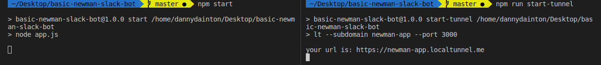
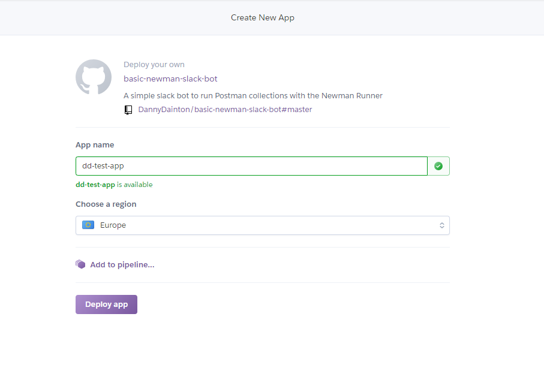
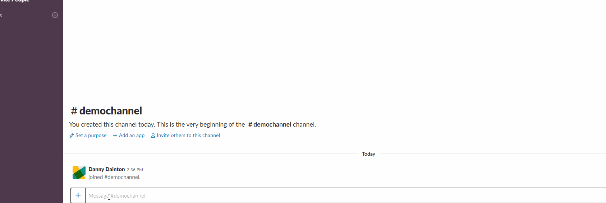
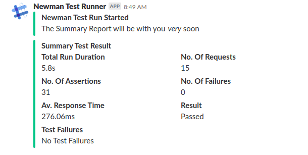
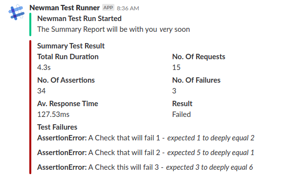
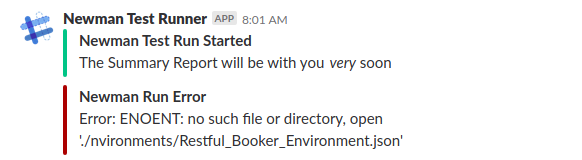

# Basic Newman Slack Bot

This is a basic `express` app with a single `POST` route, which will allow you to run Postman collections, either exported JSON files or from a shared Collection link via [newman](https://github.com/postmanlabs/newman).

Everything that you will need to run the application, including a couple of example Postman JSON files, is contained within this repo but in order for it to be accessible by Slack, it will need to be publicly hosted _somewhere_. 

Where this location/platform is, will depend on your own context, you may have sensitive data in the files and you _might_ need to have a higher level over control so choose a place that suits your needs.

## Locally running the express server

To use a Custom Slash Command in Slack, the running server needs to be a publicly accessible - How do we get around this for local testing? 

I've managed to workaround this and use my local machine as the host, by using the [localtunnel](https://localtunnel.github.io/www/) npm module.

Clone this `basic-newman-slack-bot` repo and install all the npm modules using the `npm install` command in a terminal.

**Note** - _The `basic-newman-slack-bot` has been pre-loaded with a couple of example files, these files can be found in the `./collections` and `./environments` folders. The files will _tell_ `newman` where to make requests too. We'll be using the [Restful-Booker API](https://restful-booker.herokuapp.com/), this is a publicly available set of endpoints so it might be worth doing a quick check in your browser first, just to know that the API is alive....or you might see a lot of test failures_

In the same terminal, navigate to the cloned directory and start the `express` server using the `npm start` command. This will start the app on port `3000`.

In a separate terminal, within the same directory, use the `npm run start-tunnel` command, this will return a publicly available URL that can be used in Slack. 



Follow the steps listed below in the '_How can we start using this in Slack_' section, that explains how to create the Custom Slash Command and start using the application. 

## Deploying the app to Heroku

Just as a means to *show* you it working outside of the local environment and demonstrate something you _could_ deploy yourself, I'm going to be using [Heroku](https://www.heroku.com). This is a platform-as-a-service provider, that will allow me to deploy the application code onto a machine running `nodejs`, install all the dependency modules from the `package.json` file and give me a public facing URL as an entry point into the `express` app.

Heroku offers a free account which allows you to easily get up and running in seconds, as it's a free version, the app goes to 'sleep' after a longer period of inactivity but you 'wake it up' when it receives another `POST` request. Head over to [Heroku](https://signup.heroku.com/), sign up and Log yourself in.

Once you're logged in, you can use the one click 'Deploy to Heroku' button - This will open the Heroku deploy page in the same window so I would recommend opening it in a new tab. I tried using HTML within the markdown to open it in a new window but apparently Github doesn't like this method. :( 

[](https://heroku.com/deploy?template=https://github.com/DannyDainton/basic-newman-slack-bot)

Heroku takes all the information contained in the `app.json` file and this tells it _what_ to deploy.



Give your application a unique name (I've called mine _dd-test-app_), this will form part of the URL, it will create something like this _https://dd-test-app.herokuapp.com_.

Once you have a valid name, select a region and hit the "Deploy App" button.

This will then build the application and deploy it on the Heroku platform, the whole process takes ~30 secs so it's super quick. :)

---

## How can we start using this in Slack

For this demonstration on the usage of the `express` app, I have my own personal `dannysslack`, that I created so I'm in full control of everything, this might not be the case for you. If your Slack workspace is locked down by an sort form of Admin, work with them to install the Custom Slash Command into the Workspace.

It feels a bit wrong for me to just basically repeat Slack's documentation on how to add a Custom Slash Command to a Workspace - The effort and attention that these user guides have been given is amazing, it's really easy to follow and you get up and running in next to no time.

I'm going to explain how to do it using the method I went through but for the full details, I would absolutely jump over to Slack and check out the [official guide](https://api.slack.com/slash-commands). 

- Go to the [Create a slash command](https://api.slack.com/slash-commands) page
- Scroll down to the "Creating a Slash Command" section and press the "Create your slack app" button
- In the dialog box, give your App a name (I called mine 'Newman Test Runner') and select the Workspace that the app will belong too
- Press the "Create app" button
- Select the "Slash Command" option and then press the "Create New Command" button
- Choose a command "_/something_" and add your Heroku app URL and `POST` route path - For example: "https://dd-test-app.herokuapp.com/newmanRun" if using Heroku or "https://newman-app.localtunnel.me/newmanRun" if you're running it locally.
- Give it a short description and press "Save"

We have now created our Custom Slash Command but before we can use it in the Workspace, we need to authorize it first. 

We can do this by selecting "OAuth & Permissions" from the menu options and then pressing the "Install App to Workspace" button. Finally, we hit the "Authorize" button and we're all set. 

The Custom Slash Command is now created and Authorized to be used within the specified Workspace.

---

## Using the app in a slack channel

Once the Custom Slash Command has been created and authorized against your Workspace, you can now run the command and see the results returned. In the example below, I'm using the `/testrun` command, which I added during the Slack installation, to start the run - As you've added the app to the Workspace, it will show in the auto-complete/actions list.

In the `./collections` and `./environments` folders, I've added a sample set of files that will be used to test out the integration. Let's run the command using these files and take a look at the results.



There are a couple of different responses that you will receive back into Slack once the Newman Run has completed. I'm just using a few of the details contained in the `newman summary object` that gets created after the newman test run and then displaying these in the Slack message.

If all the tests `Pass`, your message will look something like this: 



If there are any test failures from the Newman Run, these will be listed in the message under the `Test Failures` section:



If the Newman Run failed before running the Collection or there was a syntax error within a test etc. This will return a `Newman Error` message with a description of the error: 



---

## Where do I go from here

This is just an example using a set of pre-loaded files that mean absolutely nothing in your context. If you have a set of Postman JSON files containing non-sensitive information, you could add these to the `./collections` and `./environments` folders and then modify the `app.js` to point at your files. 

```javascript
        newman.run({
            collection: './collections/Restful_Booker_Collection.json',
            environment: './environments/Restful_Booker_Environment.json'
        }
```

If you _only_ have a `collection` file or a URL link to the collection, just remove the `environment` property, making sure that you also remove the comma at the end of the `collection` line. :)

```javascript
        newman.run({
            collection: './collections/Restful_Booker_Collection.json'
        }
```

As an alternative deployment method, if you wanted to deploy the `express` app on the AWS platform using a Lambda, I would take a look at using [claudiajs](https://claudiajs.com/tutorials/serverless-express.html), it makes this process so simple and you would have it up and running in a similar time as it takes with Heroku.

---

Hope this is useful to anyone wanting to give it a go, I'm a novice JS coder and I totally know my limitations. My first iteration of the app "worked" and returned what I wanted it too every time but the code was quite dodgy - I was shown a cleaner way of doing it by one of the awesome developers on our team, [Matt Davey](https://github.com/Matthew-Davey). He put me on the right path and this final version is very much his work too.

Enjoy....If you have any questions you can reach me on Twitter `@dannydainton`.
