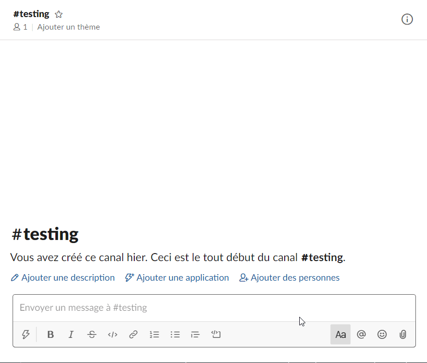
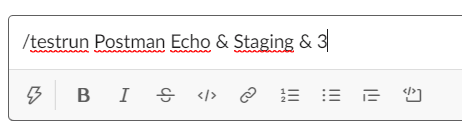
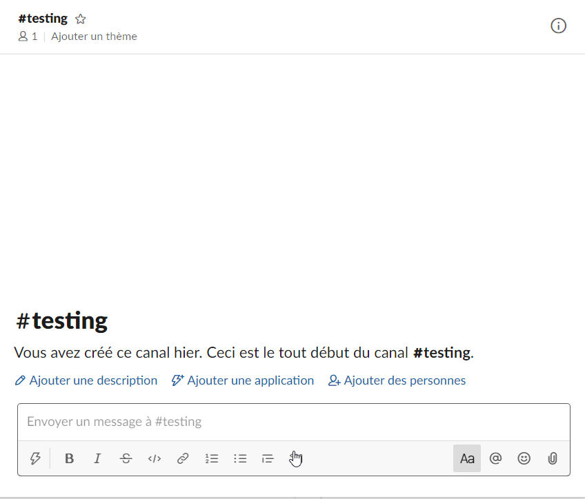
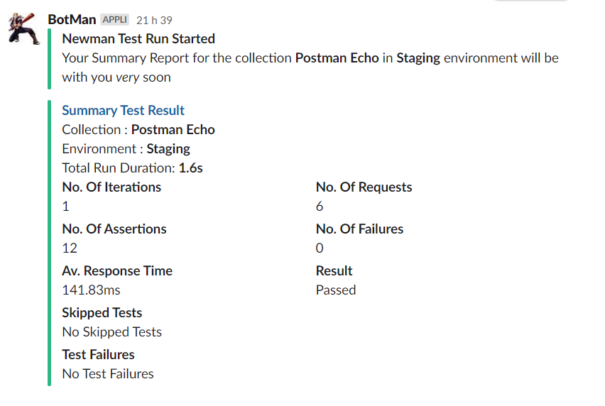
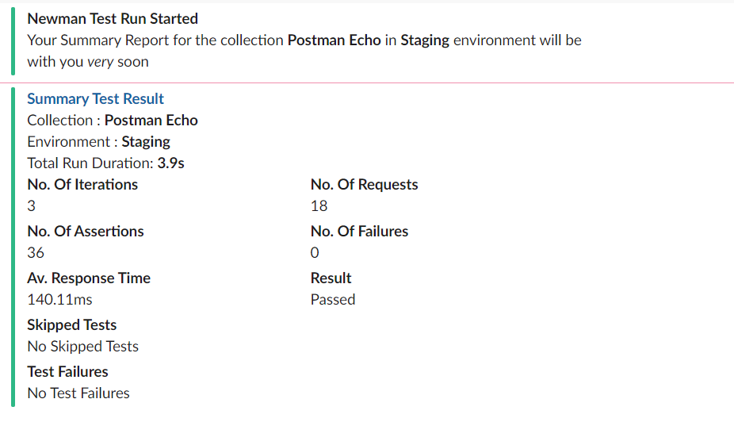

# Basic Newman Slack Bot

This is a basic [express](https://expressjs.com/) app with a single `POST` route, which will allow you to run Postman collections and environment files with [newman](https://github.com/postmanlabs/newman), straight from a Slack channel.

<!-- TOC -->

- [Installing the modules and running the express app on a local machine](#installing-the-modules-and-running-the-express-app-on-a-local-machine)
- [Locally running the express app with Docker](#locally-running-the-express-app-with-docker)
- [Installing the Newman Runner app in Slack](#installing-the-newman-runner-app-in-slack)
- [Using the Newman Runner app in a Slack channel](#using-the-newman-runner-app-in-a-slack-channel)
- [Deploying the express app to Heroku](#deploying-the-express-app-to-heroku)
- [What else can I do with the express app](#what-else-can-i-do-with-the-express-app)
    - [Change the environment file names](#change-the-environment-file-names)
    - [Add additional Newman options](#add-additional-newman-options)
    - [Custom HTML Reports](#custom-html-reports)

<!-- /TOC -->

## Installing the modules and running the express app on a local machine

To use a Custom Slash Command in Slack, the express app needs to be running and the endpoints are publicly accessible - How do we get around this for testing on a local machine?

I've managed to workaround this and use my local machine as the host, by using the [localtunnel](https://localtunnel.github.io/www/) npm module.

Clone this `basic-newman-slack-bot` repo and install all the npm modules using the `npm install` command in a terminal.

The `basic-newman-slack-bot` has been pre-loaded with a few example files, these files can be found in the `./collections` and `./environments` folders:

```sh
- collections
    - Restful_Booker_Collection.json
- environments
    - Local_Restful_Booker_Environment.json
    - Staging_Restful_Booker_Environment.json
    - Production_Restful_Booker_Environment.json
```

These files will _tell_ `newman` where to make the requests too. We'll be using the [Restful-Booker API](https://restful-booker.herokuapp.com/), this is a publicly available set of endpoints, that I had no control over so it might be worth doing a quick check first, just to know that the API is alive....or you might see a lot of test failures.

In the same terminal, navigate to the cloned directory and start the `express` server using the `npm start` command. This will start the app on port `3000`.

In a separate terminal, within the same directory, use the `npm run start-tunnel` command, this will return a publicly available URL that can be used in Slack. You should now see something that looks like the image below:


## Locally running the express app with Docker

Running the app locally using Docker can achieved using the `docker-compose up` command from the terminal. This will create the images and start the containers, once started, you can use the same localtunnel created URL _https://newman-app.localtunnel.me_ within Slack.


---

## Installing the Newman Runner app in Slack

For this demonstration, I have my own personal `dannysslack` Workspace, that I created so I'm in full control of everything, this might not be the case for you. If your Slack Workspace is locked down by any sort of Admin, work with them to install the Custom Slash Command into the Workspace.

It feels a bit wrong for me to just repeat Slack's documentation on how to add a Custom Slash Command to a Workspace - The effort and attention that these user guides have been given is amazing, it's really easy to follow and you get up and running in next to no time.

I'm going to explain how to do it using the method I went through but for the full details, I would absolutely jump over to Slack and check out the [official guide](https://api.slack.com/slash-commands).

- Go to the [Create a slash command](https://api.slack.com/slash-commands) page
- Scroll down to the "Creating a Slash Command" section and press the "Create your slack app" button
- In the dialog box, give your App a name (I called mine 'Newman Test Runner') and select the Workspace that the app will belong too
- Press the "Create app" button
- Select the "Slash Command" option and then press the "Create New Command" button
- Choose a command "_/something_" and add the app URL and `POST` route path - For example: "https://newman-app.localtunnel.me/newmanRun" if you're running it locally.
- Give it a short description and press "Save"

We have now created our Custom Slash Command but before we can use it in the Workspace, we need to authorize it first. 

We can do this by selecting "OAuth & Permissions" from the menu options and then pressing the "Install App to Workspace" button. Finally, we hit the "Authorize" button and we're all set.

The Custom Slash Command is now created and Authorized to be used within the specified Workspace.

---

## Using the Newman Runner app in a Slack channel

You can now run the command and see the results returned within any created channel in the Workspace. In the example below, I'm using the `/testrun` command, which I added during the Slack installation, to start the run - As you've added the app to the Workspace, it will show in the auto-complete/actions list.

The files in the `./environments` folder have been pre-fixed with `Local`, `Staging` and `Production` this is to show that you can _tell_ the app to run the Postman collection on a specific environment.




The example environment files in this repo contain the same data, they will send the same requests to the same endpoints and you will get back the same responses for each one. You _could_ replace these files with your own configured environments and run your requests against different endpoints. The name of the `Environment File`, listed in the _Summary Test Result_ message is taken from the `name` property inside the `.JSON` file.


There is an optional `IterationCount` parameter that can be added, This value is set to `1` by default but can be changed by specifying a `number` in the run command.





There are a couple of different responses that you will receive back into Slack once the Newman Run has completed. I'm just using a few of the details contained in the `newman summary object` that gets created after the newman test run and then displaying these in the Slack message.

If all the tests `Pass`, your message will look something like this:



If you have specified an `iteractionCount`, it will look something like this:



If there are any test failures from the Newman Run, these will be listed in the message under the `Test Failures` section:


If the Newman Run failed before running the Collection or there was a syntax error within a test etc. This will return a `Newman Error` message with a description of the error:


---

## Deploying the express app to Heroku

Just as a means to *show* you it working outside of the local environment and demonstrate something you _could_ deploy yourself, I'm going to be using [Heroku](https://www.heroku.com). This is a platform-as-a-service provider, that will allow you to deploy the application code onto a machine running `nodejs`, install all the dependencies from the `package.json` file and give you a public facing URL as an entry point into the `express` app.

Heroku offers a free account which allows you to easily get up and running in seconds, as it's a free version, the app goes to 'sleep' after a longer period of inactivity but you 'wake it up' when it receives another `POST` request. Head over to [Heroku](https://signup.heroku.com/), sign up and Log yourself in.

Once you're logged in, you can use the one click 'Deploy to Heroku' button - This will open the Heroku deploy page in the same window so I would recommend opening it in a new tab. I tried using HTML within the markdown to open it in a new window but apparently GitHub doesn't like this method. :(

[](https://heroku.com/deploy?template=https://github.com/DannyDainton/basic-newman-slack-bot)

Heroku takes all the information contained in the `app.json` file and this tells it _what_ to deploy.


Give your application a unique name (I've called mine _dd-test-app_), this will form part of the URL, it will create something like this _https://dd-test-app.herokuapp.com_.

Once you have a valid name, select a region and hit the "Deploy App" button.

This will then build the application and deploy it on the Heroku platform, the whole process takes ~30 seconds so it's super quick. :)

You will now be able to use the _https://dd-test-app.herokuapp.com/newmanRun_ URL, or whatever you called your app, within Slack by following the Custom Slash Command instructions.

---

## What else can I do with the express app

### Change the environment file names

Currently, there is a terrible bit of regex (`.match(/((Local)|(Staging)|Production)/g)`) in the `app.js` file which sets the `env` variable, to point to a specific filename. It _only_ checks to see if the word `Local`, `Staging` or `Production` has been used in the Slack command. If it doesn't recognise the environment name that was entered, you will see a message returned:


This can been altered, removed or anything that suits your needs. It was put in to show that pointing to a different environment file _could_ be done from Slack but it absolutely has it's flaws and there will be a cleaner more robust way of doing it.  

You could modify the `newman.run` object to point to your own files, in the `./collections` and `./environments` folders. In the example below, if your environment file was named `Local_Environment.json` - Using the `/testrun Local` command within Slack would run the requests using those values in the file.

```javascript
        newman.run({
            collection: './collections/My_New_Collection.json',
            environment: `./environments/${env}_Environment.json`,
            iterationCount: iterationCount,
            reporters: ['cli', 'html'],
            reporter: {
                html: {
                    export: './reports/htmlResults.html',
                    template: './reports/templates/template.hbs'
                }
            }
        }
```

### Add additional Newman options

The `newman.run` object has lots of different [options](https://github.com/postmanlabs/newman#newmanrunoptions-object--callback-function--run-eventemitter) available that will change the way the test run is configured. If you wanted to add an `iterationData` file, that holds specific values needed for the run, it can be done in the following way. The relative path to the file would need to be correct.

```javascript
        newman.run({
            collection: './collections/Restful_Booker_Collection.json',
            environment: './environments/Local_Restful_Booker_Environment.json',
            iterationCount: iterationCount,
            iterationData: './mynewfolder/mydatafile.csv',
            reporters: ['cli', 'html'],
            reporter: {
                html: {
                    export: './reports/htmlResults.html',
                    template: './reports/templates/template.hbs'
                }
            }
        }
```

### Custom HTML Reports

I've added the [newman-reporter-html](https://github.com/postmanlabs/newman-reporter-html) module to the app, this creates a custom HTML report that will show the full summary of the newman test run.  

This will **not** store the results of each test run separately, it will overwrite the last run. This also, by default, aggregates all the iteration data together, which is not ideal. This can be handled with a custom report template to separate each run but for now it has this limitation.

The Slack message output looks the _same_ but the `title` is now a hyperlink that points to _https://newman-app.localtunnel.me/htmlResults.html_ - By clicking this link, it will open up the report in a new browser tab.


The report is created using an optional custom template file, this can be found in the `./reports/templates` folder. The `newman-reporter-html` reporter will just create a default styled report if you don't add the `template` property.

If you choose to use the [_Deploying the express app to Heroku_](#deploying-the-express-app-to-heroku) method to host your express app, you will need to change the `title-link` property in the `app.js` file, to point to your heroku app URL, in order to see the generated report. Currently, this is hardcoded to the local URL.

For example:

```javascript
    "title_link": "https://your-heroku-app.herokuapp.com/htmlResults.html"
```

The HTML report functionality is still very limited, I will be improving this to give you the ability to store the reports. I use a method to store the reports to an AWS S3 bucket but this isn't really a generic solution to add to the express app.

---

Hope this is useful to anyone wanting to give it a go, I'm a novice JS coder and I totally know my limitations. My first iteration of the app "worked" and returned what I wanted it too every time but the code was quite dodgy - I was shown a cleaner way of doing it by one of the awesome developers on our team, [Matt Davey](https://github.com/Matthew-Davey). He put me on the right path and this final version is very much his work too.

Enjoy....If you have any questions about the app or any feedback, you can reach me on Twitter `@dannydainton`.